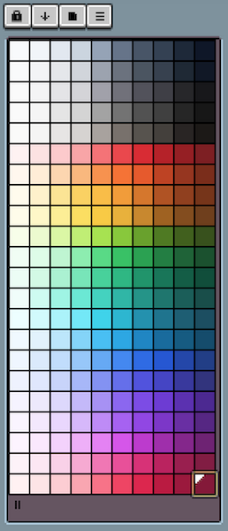

# Tailwind Palette

Palette file for [Aseprite](https://www.aseprite.org/), generated based off of the [TailwindCSS default palette](https://tailwindcss.com/docs/customizing-colors#default-color-palette).

## Getting started

To install:

- Download/clone this repo.
- Open Aseprite.
- Click "Load Palette" from the color palette menu.
- Navigate to project folder and select the `tailwind.gpl` file.

To regenerate `.gpl` file yourself:

- Install NodeJS LTS version.
- `npm run install` command within the project directory to acquire dependencies.
- `npm run build` to regenerate the `tailwind.gpl` file.

## Example

